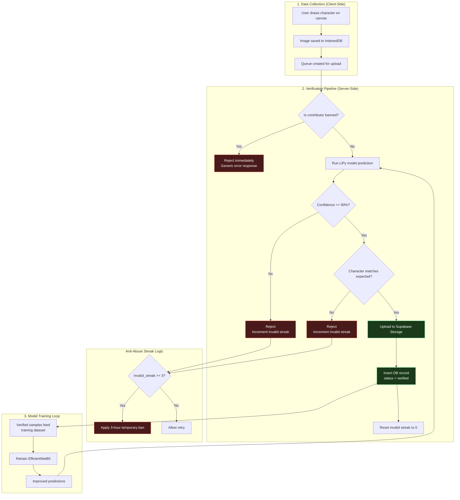
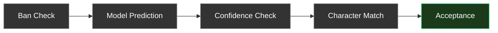
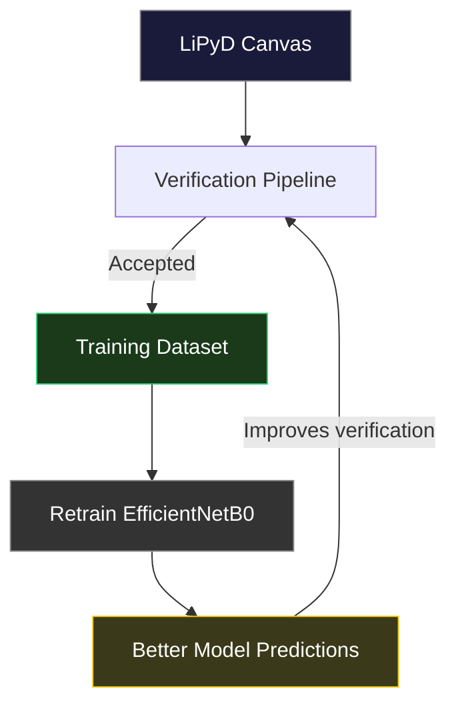

# LiPy Frontend

The frontend for the LiPy Odia OCR project is a modern, responsive web application built using **Next.js (App Router)** and **React**.

## Tech Stack

- **Framework**: Next.js 16 (App Router)
- **Styling**: Tailwind CSS v4
- **Language**: TypeScript 6
- **Animations**: Motion
- **Deployment**: Vercel
- **Database**: Supabase / Dexie (IndexedDB)

## Architecture

The frontend is modularized into feature-based workspaces:

- **`components/ocr/`**: OCR Workspace for character recognition.
  - Features multiple input modes (Camera, Drawing, Upload) via modular tabs.
  - Sends image data to the FastAPI backend for real-time predictions.
  - Displays elastic prediction result cards with confidence metrics.
- **`components/lipyd/`**: Data Contributor Workspace (LiPyD), allowing users to draw and build character datasets directly from the browser.
- **`components/about/`** and **`components/team/`**: Informational pages describing the mission and contributors.
- **`components/navigation/`**: Responsive navbar with mobile support and legal links.
- **`components/admin/`**: Admin dashboard shell and settings.

## LiPyD Workflow: Data Collection → Verification → Model Training

LiPyD (LiPy Dataset Contributor) is the crowdsourced data pipeline that feeds high-quality handwritten Odia character samples into the training loop. The workflow has three stages:

### End-to-End Flow



### 1. Data Collection

Contributors draw Odia characters on an HTML5 canvas board in the browser.

- **Canvas input** — users see a target character (e.g., "ଅ") and draw it with configurable stroke width
- **Mixed-random mode** — the scheduler intelligently picks the next character based on dataset balance, prioritizing under-represented classes
- **Single-character mode** — contributors can focus on drawing one specific character repeatedly
- **Local storage** — every sample is saved immediately to IndexedDB (`LiPyDB`) and queued for upload, enabling offline-first operation
- **Session tracking** — each contributor session records mode, sample count, and per-character progress

```
User draws character on canvas
  → Image blob saved to IndexedDB (samples table)
  → Queue item created (uploadQueue table)
  → Upload processed asynchronously
```

### 2. Automatic Verification & Anti-Abuse

Every submitted sample passes through a server-side verification pipeline before it enters the permanent dataset. This is completely invisible to contributors.

**Verification Pipeline Stages:**



| Stage | Description |
|-------|-------------|
| **Ban Check** | If the contributor has 3+ consecutive failures, they are silently banned for 3 hours. All submissions during a ban are immediately rejected without processing. |
| **Model Prediction** | The LiPy recognition model (EfficientNetB0) predicts the character from the submitted image. |
| **Confidence Check** | The prediction confidence must exceed a configurable threshold (default 90%). |
| **Character Match** | The predicted character must exactly match the expected character the contributor was asked to draw. |
| **Acceptance** | If all checks pass, the image is uploaded to Supabase Storage and a database record is created with `status = "verified"` and `verified_by = "00000000-0000-0000-0000-000000000000"` (the auto-verification service sentinel). The contributor's invalid streak is reset to 0. |

**If any stage fails:**
- The image is **never** uploaded to storage
- No database record is created
- The contributor's invalid streak is incremented
- The contributor receives only a generic message: "Unable to process this submission. Please try again."
- No internal details (prediction, confidence, ban status, streak count) are ever exposed to the user

**Banned contributor behavior:**
- Once `invalid_streak >= 3`, a temporary ban is applied for a configurable duration (default 3 hours)
- Banned contributors receive the **exact same generic error message** as a failed verification
- The frontend cannot distinguish between a ban rejection and a normal verification failure

**Verification traceability:**
Accepted samples are stored with:
- `status = "verified"` — consistent with manually verified samples for unified handling in the admin UI
- `verified_by = "00000000-0000-0000-0000-000000000000"` — a sentinel UUID that identifies the auto-verification service (the admin dataset viewer displays "Auto-Verification Service" for this UUID)
- `verified_at` — timestamp of when verification occurred
- `metadata.verifiedBy = "verification_service"` — a human-readable identifier stored inside the JSONB `metadata` field for easy querying

Manually verified samples (via admin dataset viewer) use the admin's actual Supabase auth UUID as `verified_by`, clearly distinguishing auto-verification from manual review.

**Internal logging (admin-only):**
Every verification attempt is logged both in-memory (fast cache) and persisted to a `verification_logs` table in Supabase (durable, survives restarts).

Logged fields:
`timestamp`, `contributor_id`, `expected_character`, `predicted_character`, `confidence`, `accepted`, `invalid_streak_after_request`, `temporary_ban_applied`, `processing_time_ms`, `stage`, `reason`

Logs are queryable from the admin dashboard, filtered by accepted/rejected status, and survive server deploys and cold starts.

### 3. Model Training

Verified samples (`status = "verified"`) form the training dataset.

- **Export** — the dataset can be exported from the admin dashboard or via the database directly
- **Hugging Face** — the curated dataset is published on Hugging Face for reproducibility
- **Training pipeline** — EfficientNetB0 is retrained on the growing dataset, with each new batch of verified samples improving accuracy
- **Continuous improvement** — as more contributors verify samples, the training data becomes more robust, leading to better model predictions, which in turn improves verification accuracy



### Modifiers & Customization

| Setting | Env Variable | Default |
|---------|-------------|---------|
| Min confidence threshold | `NEXT_PUBLIC_LIPY_MIN_CONFIDENCE` | `0.90` |
| Max invalid streak before ban | `NEXT_PUBLIC_LIPY_MAX_INVALID_STREAK` | `3` |
| Temp ban duration (hours) | `NEXT_PUBLIC_LIPY_TEMP_BAN_HOURS` | `3` |
| Storage bucket name | `NEXT_PUBLIC_LIPY_STORAGE_BUCKET` | `lipy-samples` |

## Important Hooks

- **`useCanvasDrawing.ts`**: Manages canvas drawing states, brush logic, clearing, and initialization for both OCR and Dataset Contributor modules.
- **`useCharacterSelection.ts`**: Controls the character selection and navigation flow in the LiPyD contributor workspace.
- **`useDatasetSync.ts`**: Manages data payload state and synchronization for user-generated Odia character contributions via IndexedDB, cookies, and localStorage.

## Admin Dashboard

The admin dashboard (`/admin`) provides role-based access to manage the dataset, verify contributions, configure security settings, and monitor the verification system.

### Admin Pages

| Route | Purpose |
|-------|---------|
| `/admin` | Dashboard overview with stats and recent activity |
| `/admin/dataset` | Browse, audit, verify, and delete handwritten samples |
| `/admin/verification` | Monitor verification logs, contributor streaks, and active bans |
| `/admin/settings` | Manage authentication methods, linked accounts, and security |

### Admin Roles

Users must be added to the `admins` table in Supabase to access the dashboard. Roles follow a hierarchy where higher roles inherit all permissions of lower roles.

| Role | View Dashboard | Verify/Unverify Samples | Delete Samples |
| ---- | :------------: | :---------------------: | :------------: |
| `viewer` | Yes | No | No |
| `verifier` | Yes | Yes | No |
| `admin` | Yes | Yes | Yes |
| `owner` | Yes | Yes | Yes |

- **viewer** — Read-only access to the dataset viewer and dashboard stats.
- **verifier** — Can verify and unverify dataset samples (sets `verified_by` and `verified_at` audit fields).
- **admin** — Can verify samples and delete rejected samples from the dataset.
- **owner** — Full access. Same as admin, reserved for the primary administrator.

### Authentication & Security

- **Passkey support** — Passwordless WebAuthn login.
- **Email/password login** — Standard credentials with optional Google/GitHub OAuth.
- **Forgot password** / **Reset password** flows.
- **Session revocation** — Administrators can revoke active sessions.
- **Security activity logging** — 12 event types tracked (login, logout, failed login, passkey registration, session revocation, etc.) with IP, browser, OS, and device metadata.
- **Rate limiting** and **CSP headers** enforced via Next.js middleware proxy.

### Database Schema

The Supabase SQL schema script is located at `scripts/database/schema.sql`. It creates all tables (`lipy_contributors`, `lipy_sessions`, `lipy_samples`, `security_events`, `admins`), RLS policies, storage buckets, and helper functions. Safe to run multiple times.

To apply: open the **Supabase Dashboard → SQL Editor**, paste the script, and execute.

## Local Development

Ensure you have Node.js installed, then start the frontend:

1. Install dependencies:
```bash
npm install
```

2. Start the development server:
```bash
npm run dev
```

3. Open `http://localhost:3000` to view the application.

## Environment Variables

| Variable | Description |
| -------- | ----------- |
| `NEXT_PUBLIC_API_URL` | The URL of the deployed FastAPI backend (e.g., `https://api.lipy.app`). Ensure this is set for Next.js to successfully ping the `POST /predict` endpoint. |
